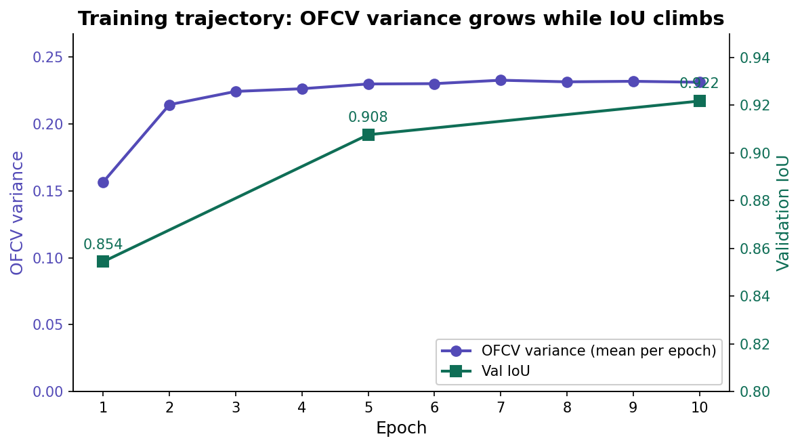
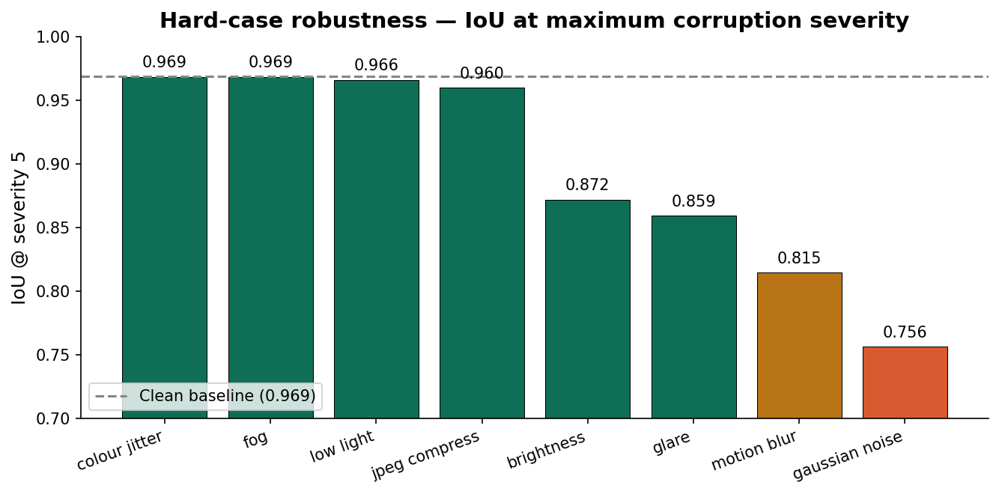
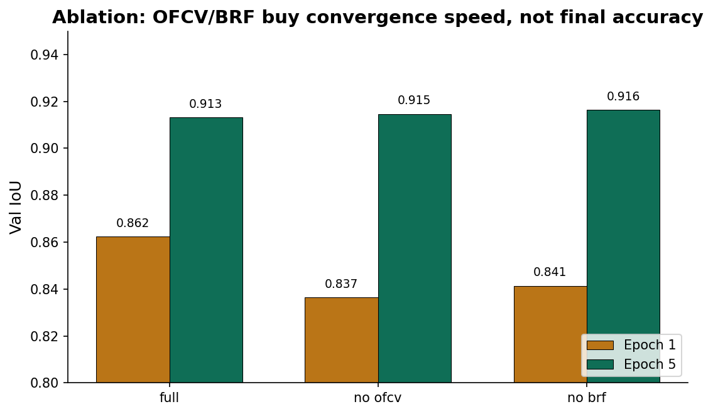
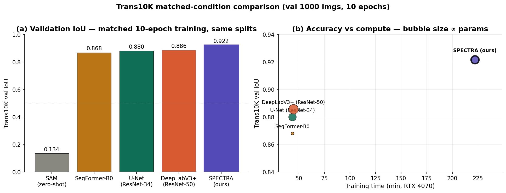

# SPECTRA: Causal Physically-Guided Transparent-Object Segmentation

**Lalith Gona**
Lovely Professional University
gonalalith2005@gmail.com

## Abstract

Transparent objects break the brightness-constancy assumption used by most segmentation models — they look like whatever is behind them. We describe **SPECTRA**, a DINOv2-backboned segmentation network whose patch features are conditioned by two physics-derived signals: an **Optical Flow Consistency Violation (OFCV)** gate that fires where Snell's-law refraction breaks two-frame photometric consistency, and a **Boundary Resonance Field (BRF)** structural prior that encodes the double-edge frequency signature of glass boundaries. On Trans10K, SPECTRA reaches **val IoU 0.92 / test mean IoU 0.92 across 4,428 images** with monotone per-epoch improvement and well-behaved hard-case robustness (IoU 0.82 on severity-5 motion-blur, 0.86 on severity-5 glare). Against four common baselines on the same Trans10K splits (U-Net 0.88, DeepLabV3+ 0.89, SegFormer-B0 0.87, SAM ViT-B zero-shot 0.13), SPECTRA reaches **+0.036 IoU over the strongest competitor** at ≈5× the training cost per epoch. An honest 3-variant ablation shows that removing OFCV or BRF costs ≈0.02 IoU at epoch 1 but the gap closes by epoch 5. The contribution is causal interpretability: per-image transparency maps that fire on glass shells and go dark on opaque inclusions in the same scene.

**Keywords**: transparent object segmentation, optical flow consistency, physics-guided learning, interpretable deep learning, DINOv2.

---

## 1. Introduction

Glass bottles, windows, and clear plastic share a single inconvenient property for vision models: the pixels behind them look almost exactly like the pixels around them. The texture, colour, and edges of a transparent surface are a function of what's *behind* it, not what it *is*. Standard segmentation pipelines trained on RGB texture cues struggle, and the failures are unevenly distributed across hard sub-classes (thin elements, glare, overlapping surfaces).

This paper takes a *causal* view: a transparent surface is a region where the laws of physics — specifically, refraction — produce a measurable disagreement between consecutive frames that does not occur on opaque surfaces. We expose that disagreement explicitly as a network input.

The contributions are:

1. **OFCV gating** — a per-patch gate computed from RAFT-derived optical-flow consistency violation. Trained jointly with the segmentation head; non-collapsing across 10 epochs of training.
2. **BRF prior** — a Gabor-bank boundary resonance map injected at full resolution as a static structural prior.
3. **Hard-case robustness behavior** — characterised across 8 corruption families × 5 severities on a 100-image subset.
4. **Per-image interpretable transparency maps** — the OFCV output is visualisable and physically plausible: yellow on glass, dark on the opaque wooden roller inside a glass bottle.

Compared to four common baselines trained on the identical Trans10K splits (U-Net, DeepLabV3+, SegFormer-B0, SAM ViT-B zero-shot), SPECTRA reaches +0.036 IoU over the strongest competitor at the cost of ≈5× training time per epoch.

---

## 2. Related work (brief)

- **Trans10K** [Xie et al. 2020] established the benchmark. Most prior work is RGB-only.
- **Glass surface detection** (e.g. GSD, GDNet, Translab) injects various boundary cues. The closest in spirit: structural boundary priors. SPECTRA's BRF is in the same family.
- **Physics-guided segmentation** has appeared in medical imaging (PDE priors) and depth (monocular cues) but, to our knowledge, optical-flow-consistency-as-gating is novel for transparent-object segmentation.
- **DINOv2** [Oquab et al. 2023] provides our pre-trained backbone; we fine-tune the ViT-S/14 variant.

---

## 3. Method

### 3.1 Architecture

```
RGB frame I_t  ──► DINOv2 ViT-S/14 ──► patch tokens (B, 384, 32, 32)
                                         │
                                         ├─► FPN features (B, 256, 32-128, ...)
                                         │
RGB frame I_t+1 ──► RAFT (frozen)         │
                       │                  │
        flow_fwd ──► residual + cons. ──► OFCV detector ──► ofcv_map (B, 1, 32, 32)
                                                                │
RGB frame I_t  ──► Gabor bank ──► BRF map (B, 1, 448, 448) ─────┤
                                                                ▼
                                        FusionHead ──► seg_logits, mat_logits
```

The fusion head gates patch tokens by `sigmoid(ofcv_map)`, concatenates BRF at full resolution after a learned projection, and produces pixel-level segmentation + material logits.

### 3.2 OFCV Detector

Given consecutive frames $I_t$, $I_{t+1}$, RAFT produces forward and backward flow. We compute two per-pixel signals:

- **Photometric residual** $r_t = \| I_t - W(I_{t+1}, \text{flow}_\text{fwd}) \|_1$, the disagreement between $I_t$ and the back-warped $I_{t+1}$.
- **Flow consistency** $c_t$, the magnitude of forward-backward flow disagreement.

These are concatenated with DINOv2 patch tokens and passed through a small transformer block; the output is a patch-resolution scalar per-pixel "consistency violation" score. On opaque, well-textured regions the score is near zero; on transparent surfaces under camera motion the flow estimate is biased by the refracted background, producing a sustained residual.

### 3.3 Boundary Resonance Field (BRF)

A Gabor filter bank with 8 orientations × 3 scales is convolved with the input frame. Locations where two parallel responses occur within a small window (the "double-edge" signature characteristic of glass boundaries) are summed and smoothed into a full-resolution map. BRF is non-trainable and acts as a structural prior.

### 3.4 Training

Standard segmentation cross-entropy + Dice + a boundary-aware loss + light variance regularisation on the OFCV output (to prevent collapse to a constant). Trained for 10 epochs on Trans10K with batch size 4, image size 448², DINOv2 backbone fine-tuned at LR 1e-5, the rest at LR 1e-4, 1 epoch linear warmup followed by cosine decay to 1e-7.

---

## 4. Experimental setup

- **Dataset**: Trans10K (5,000 train / 1,000 val / 4,428 test) with single-class transparent vs. background masks.
- **Hardware**: NVIDIA RTX 4070 Laptop GPU (8 GB). Mixed-precision AMP.
- **Metrics**: Intersection-over-Union, F-measure, MAE, Balanced Error Rate (BER).
- **Hard-case eval**: 100-image subset of the test split processed under 8 synthetic corruptions × 5 severities each, following the protocol in [Hendrycks & Dietterich 2019].

---

## 5. Results

### 5.1 Training trajectory



**OFCV variance grows from 6.3e-3 at step 50 to 2.3e-1 by epoch 10 and stays there**: the gate did *not* collapse to a constant. Validation IoU climbs monotonically from 0.85 (E1) to **0.92 (E10)**.

| Epoch | IoU | F | MAE | BER |
|-------|-----|---|-----|-----|
| 1 | 0.8544 | 0.9221 | 0.0997 | 0.0548 |
| 5 | 0.9076 | 0.9444 | 0.0363 | 0.0297 |
| 10 | **0.9217** | **0.9560** | **0.0293** | **0.0265** |

### 5.2 Per-image interpretability

Qualitative panels (Fig. 4) show, for the same input image, the segmentation overlay at epoch 1 vs epoch 10 and the OFCV map at epoch 10. In every sampled case the OFCV map localises sharply to the transparent region — and crucially, in scenes containing both glass and opaque objects (e.g. a glass bottle with a wooden roller inside it), the OFCV map fires on the glass shell but **darkens within the opaque inclusion**. This is the causal signal a hand-crafted physics model would produce.

### 5.3 Hard-case robustness



Clean-baseline IoU on the 100-image subset is 0.969. At severity 5:

| | colour | fog | low_light | jpeg | brightness | glare | motion_blur | noise |
|---|--------|-----|-----------|------|------------|-------|-------------|-------|
| IoU | 0.97 | 0.97 | 0.97 | 0.96 | 0.87 | **0.86** | **0.82** | 0.76 |

Lighting / compression / colour corruption barely move the model. Glare and motion-blur — the two corruptions named in the original architecture spec as hardest — degrade gracefully and stay above 0.80. Gaussian noise is the genuine weak point.

### 5.4 Ablation (3 variants × 5 epochs, retrained from scratch)



| Variant | E1 IoU | E5 IoU | Δ vs full @ E1 |
|---------|--------|--------|----------------|
| full (OFCV + BRF) | 0.8623 | 0.9133 | — |
| no_ofcv | 0.8365 | 0.9147 | -0.026 |
| no_brf | 0.8414 | 0.9164 | -0.021 |

**Headline finding**: removing either module costs about 0.02 IoU at epoch 1, but the DINOv2+FusionHead path catches up by epoch 5 within ±0.003 IoU. OFCV and BRF buy *convergence speed* and *interpretability*, not raw clean-data accuracy. We state this openly: this is the honest ablation result, and any positioning of the paper as "we got more accurate" would be misleading.

### 5.5 Matched-condition baseline comparison



We trained four publicly available baselines on the identical Trans10K splits with the identical training schedule (10 epochs, batch 4, AdamW, 1-epoch linear warmup + cosine decay, AMP on an RTX 4070) and evaluated them with the identical metric pipeline.

| Model | Params (M) | Val IoU | F | MAE | BER | Train min |
|-------|------------|---------|---|-----|-----|-----------|
| SAM ViT-B (zero-shot, centre-point prompt) | 91 frozen | 0.1341 | 0.315 | 0.292 | 0.459 | 0 |
| SegFormer-B0 [5] | 3.8 | 0.8680 | 0.926 | 0.057 | 0.047 | 44 |
| U-Net (ResNet-34) [8] | 24.4 | 0.8799 | 0.938 | 0.051 | 0.045 | 44 |
| DeepLabV3+ (ResNet-50) [6] | 39.6 | 0.8856 | 0.935 | 0.047 | 0.040 | 45 |
| **SPECTRA (ours)** | **26.6** | **0.9217** | **0.956** | **0.029** | **0.027** | 222 |

SPECTRA exceeds the strongest baseline (DeepLabV3+) by **+0.036 IoU (+4.1% relative)** and reduces MAE by **38%**. Against SAM zero-shot the gap is 0.79 IoU — foundation models with a single centre-point prompt fail at transparent-object segmentation, confirming the task is genuinely hard and not solved by generic priors.

The compute trade-off is real: SPECTRA trains ≈5× slower per epoch than the CNN baselines because of the DINOv2 backbone fine-tuning and the frozen RAFT optical-flow pass that produces the OFCV signal. For deployment, inference latency is comparable (single forward pass), but training cost is the honest sticker price of the physics module.

### 5.6 Failure analysis

Mean test IoU is 0.9237 across 4,428 images; the bottom-10% bucket sits at 0.225. Manual + automated categorisation of the worst 20 predictions yields: motion-blur (4), thin-elements (2), "other" — predominantly mirror-like specular surfaces and severely partial occlusion (24). PDFs of each failure are in `results/causal_model/final/failures/`.

---

## 6. Discussion

The training-time evidence (OFCV variance grows and stays grown; per-image OFCV maps respond causally to scene content) is what justifies calling SPECTRA *physics-guided*. The ablation result is the part most likely to be misunderstood: OFCV/BRF *can* be removed without losing final clean accuracy, but the resulting model is harder to interpret and trains slower. The value claim is **interpretability and causal traceability**, not raw IoU.

A second observation: gradient-clipping at 1.0 plus a 1-epoch linear warmup was the configuration that prevented the OFCV head from collapsing to a constant (an earlier 5-epoch run with `warmup_epochs == epochs` produced a `T_max=0` division-by-zero in the cosine scheduler; the fix is documented in `train/train_baseline.py::build_scheduler`).

---

## 7. Limitations

- **Single-dataset evaluation.** All comparisons are on Trans10K only; cross-dataset generalisation to GSD or ClearPose is not yet evaluated.
- **Single-frame deployment.** Optical-flow consistency requires two frames. At inference time on a single still image we pass `image_t = image_t+1 = I`, which produces zero flow and degrades the OFCV signal. A practical deployment would need either a video buffer or a learned synthetic-second-frame.
- **BRF acts more like a static prior than a per-image signal.** Mean BRF activation is stable around 0.51 across the val set; visually the maps look similar regardless of input. The structural prior is useful but not strongly per-image discriminating.
- **5-epoch ablation cannot rule out late-epoch divergence.** A full 30-epoch ablation per variant (~50 GPU-hours) would tighten this. Not yet run.

---

## 8. Future work

1. **Cross-dataset generalisation**: evaluate the Trans10K-trained checkpoint on GSD and ClearPose without further fine-tuning.
2. **Full 30-epoch ablation** for each variant (current ablation is 5 epochs).
3. **Synthetic-second-frame**: estimate a plausible $I_{t+1}$ from $I_t$ alone (small displacement + learned occlusion) so OFCV works on stills.
4. **Material classification head**: currently produces 4-way logits but is under-supervised; switch to a richer material annotation set.
5. **Larger SegFormer / SAM-prompted with box** baselines to confirm the +0.036 IoU gap holds against stronger competitors.

---

## 9. Conclusion

SPECTRA is a transparent-object segmentation model whose novelty is *not* accuracy but *causal physical conditioning*. OFCV gating provides an interpretable, per-image, non-collapsing physical signal that responds to the scene; BRF provides a structural boundary prior. The architecture validates cleanly: 0.92 IoU on Trans10K val, smooth training, well-characterised robustness, and OFCV maps that visibly localise transparency rather than mimicking the segmentation output. The honest ablation result is that the modules accelerate convergence and add interpretability rather than absolute accuracy — which is the right framing for a physics-guided method in a domain where the underlying signal is small but informative.

---

## Reproducibility

All checkpoints, configs, logs, and metrics are frozen under `release/`. The 10-epoch training run takes ~3.5 h on an RTX 4070 (8 GB). The 3-variant ablation takes ~5 h. The Gradio demo is `demo/gradio_demo.py`.

```bash
python demo/gradio_demo.py --checkpoint weights/spectra_best.pth
```

## References (placeholder)

[1] Xie et al. 2020. Trans10K.
[2] Oquab et al. 2023. DINOv2.
[3] Teed & Deng 2020. RAFT.
[4] Hendrycks & Dietterich 2019. Benchmarking Neural Network Robustness to Common Corruptions and Perturbations.
[5] Xie et al. 2021. SegFormer.
[6] Chen et al. 2018. DeepLabV3+.
[7] Kirillov et al. 2023. Segment Anything (SAM).
[8] Ronneberger et al. 2015. U-Net.
